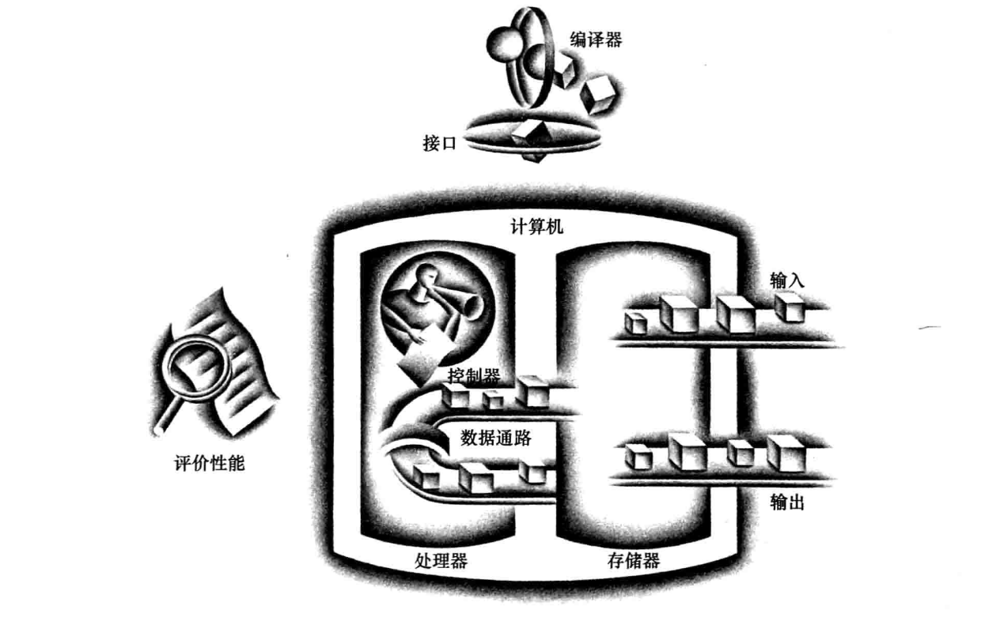
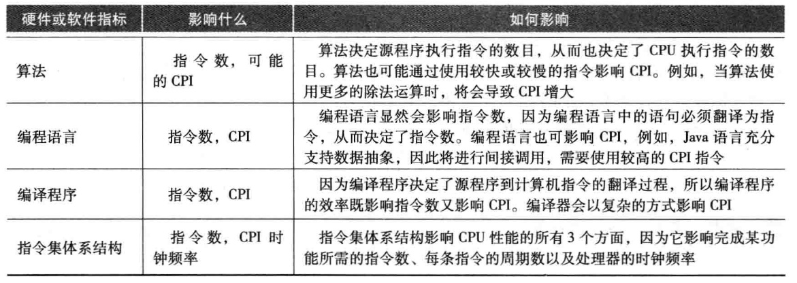
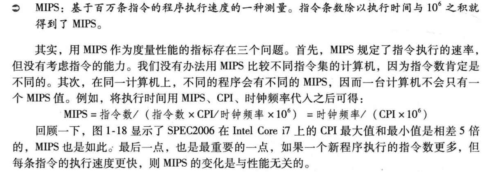

## 计算机概要与技术

### 引言

#### 1.1.1计算机应用的分类及其特性

- 个人计算机
- 服务器
- 嵌入式计算机

#### 1.1.2欢迎来到后pc时代

- 个人移动设备 PMD
- 云计算

#### 1.1.3 你能学到什么

一言以蔽之：**性能**

-------

### 计算机系统结构的8个伟大思想

- 面向摩尔定律的设计

  每18-24个月，单芯片的集成度翻一番

- 使用抽象简化设计

  使用抽象来表示不同的设计层次，在高层次中看不到低层次的细节，只能看到一个简化的模型

- 加速大概率事件

- 通过并行提高性能

- 通过流水线提高性能

  流水线是一个特别的并行场景

- 通过预测提高性能

- 存储器层次

  一个堆叠的三角形，越靠近顶端，存储区速度越快、价格越高；越靠近底端，容量越大、速度越慢、价格越低。

- 通过冗余提高可靠性

--------

### 程序概念入门

应用软件->系统软件->硬件

- 系统软件：提供常用服务的软件。包括操作系统、编译程序、加载程序、汇编程序
  - 操作系统是用户程序和硬件之间的接口，为用户提供各种服务和监控功能。最为重要的作用：
    - 处理基本的输入与输出操作
    - 分配外存和内存
    - 为多个应用程序提供共享计算机资源的服务
  - 编译程序把高级语言编写的程序翻译成硬件能执行的指令。

#### 从高级语言到硬件语言

高级语言  --<u>编译</u>--  > 汇编语言程序（MIPS指令集）--<u>汇编</u>--  > 二进制机器语言程序（每一层都是一个抽象）

```
高级语言： A + B
汇编语言： add A, B
机器语言： 1000110010100000
```

--------

### 硬件概念入门

五个经典部件：（运算器和控制器合称为处理器）

- 输入设备
- 输出设备
- 存储器
- 数据通路（运算器）		
- 控制器



#### 打开机箱

- 集成电路（芯片）

- 处理器（中央处理单元）

  - 数据通路（运算器）：完成算数运算
  - 控制器：指导数据通路、存储器和I/O设备按照程序的指令正确执行。

- 内存

  内存是程序运行时的存储空间，同时还存储程序运行时所需的数据。由DRAM芯片组成（动态随机访问存储器）

  支持随机访问

- 缓存（cache memory）

  是一种小而快的存储器，一般作为大而慢的存储器的缓冲。cache采用的是另一种存储技术，称为静态随机访问存储器。

- 指令集体系结构（体系结构）

  是低层次软件和硬件之间的抽象接口，包含了需要编写正确运行的机器语言程序所需要的全部信息，包括指令、寄存器、存储访问和I/O等

- 应用二进制接口

  用户部分的指令加上应用程序员调用的操作系统接口。定义了二进制层次可移植性的计算机标准。

计算机体系结构可以让计算机设计者独立的讨论功能，而不必考虑具体硬件。计算机设计者将体系结构和体系结构的**实现**（遵循体系结构抽象的硬件）分开考虑也是沿着同样的思路：硬件的实现方式必须依照体系结构的抽象。

#### 数据安全

- 易失性存储器：类似DRAM的存储器，仅在加电时保存数据。如计算机的内存

- 非易失性存储器：掉电时也可保持数据，用于存储运行间的程序。如磁盘、DVD。在 PMD 中闪存代替了磁盘

  称为二级存储器

前者称为主存储器、后者称为二级存储器

#### 与其他计算机通信

- 局域网
- 广域网

--------

###   处理器和存储器制造技术

- 晶体管（IC：集成电路）
- 超大规模集成电路
- 芯片

--------

### 性能

#### 性能的定义

- 响应时间（执行时间）：计算机完成某任务所需的总时间，包括硬盘访问、内存访问、I/O活动、操作系统开销和CPU执行时间。
- 吞吐率（带宽）：性能的另一种度量参数，表示单位时间完成的任务数量

#### 性能的度量

- 响应时间（墙上时钟时间）：完成任务的的总时间
- CPU执行时间：执行某一任务在CPU上所花费的时间
- 用户CPU时间：在程序本身花的CPU时间
- 系统CPU时间：为执行程序而在操作系统上花的时间

为了一致性，保持基于响应时间和基于CPU执行时间的性能差异，我们用：

- 系统性能：表示空载系统的响应时间
- CPU性能：表示用户CPU时间

几乎所有计算机都用时钟来驱动硬件中发生的各种事件

- 时钟周期：计算机一个时钟周期的时间，通常是处理器时钟
- 时钟频率：时钟周期250ps，时钟频率4Ghz
- 时钟长度：每个时钟周期持续的时间长度

#### CPU性能及其因素

```
一个程序的CPU执行时间 = 一个程序的CPU时钟周期数 * 时钟周期时间 = 一个程序的CPU时钟周期数 / 时钟频率
```

#### 指令的性能

- CPU时钟周期数 = 程序的指令数 * 每条指令的平均时钟周期数

- CPI：每条指令的时钟周期数平均值

####  经典的CPU性能公式

```
CPU时间 = 指令数 * CPI * 时钟周期时间
CPU时间 = 指令数 * CPI / 时钟频率
```



--------

### 功耗墙

能耗 正比于 负载电容 * 电压^2

功耗 正比于 1 / 2 * 负载电容 * 电压^2 * 开关频率

降低功耗我们希望通过降低电压来实现，但是为了保持电路是通路，电压也不能太低。

--------

### 沧海巨变：从单处理器向多处理器转变

并行处理

--------

### 谬误与陷阱

陷阱：在改进计算机的某个方面时期望总性能的提高与改进大小成正比

- Amdahl定律（收益递减定律）：改进后的执行时间 = 受改进影响的执行时间 / 改进量 + 不受影响的执行时间

谬误：利用率低的计算机功耗低

陷阱：用性能公式的一个子集去度量性能（简单的只用时钟频率、指令数、CPI之一来预测性能）

MIPS（每秒百万条指令） = 指令数 / （执行时间 * 10^6）

MIPS是指令执行的速率，规定性能与执行时间成反比。



谬误：面向性能的设计和面向能量效率的设计具有不相关的目标

--------

### 小结

- 最重要的抽象层次是硬件和底层软件之间的接口，称为**指令体系结构**。

- 任何一个独立的因子都不能确定性能，只有三个因子的乘积（执行时间），才是可靠的性能度量标准。