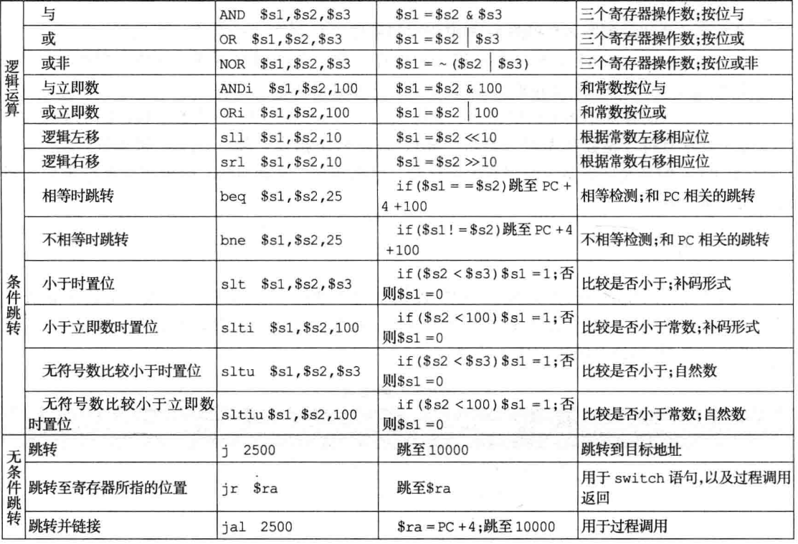
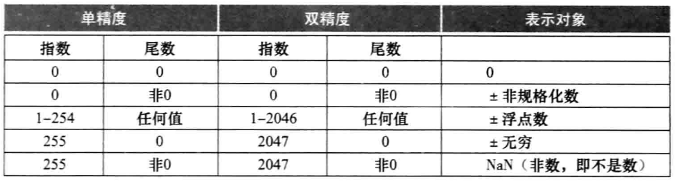

## 计算机的算术运算

### 引言

- 小数和其他实数如何表示
- 当一个操作生成了一个无法表示的大数时如何处理
- 怎么用硬件真正的做乘法和除法

----------------------------

### 加法和减法

二进制加法直接计算

二进制减法可以直接操作或者加上负的后一个数的补码来实现（7-6=7+（-6）-6用二进制补码表示）

计算机设计者必须提供一种方法，能够在某些情况下忽略溢出的发生，而在另一些情况下进行溢出的检测。

- 加法指令（add）、立即数加法指令（addi）和减法指令（sub），在溢出时产生异常
- 无符号加法（addu）、立即数无符号加法（addiu）和无符号减法（subu）在发生溢出时不会产生异常。

C语言忽略溢出，所以MIPS C 编译器总是采用无符号的算数指令

附录B描述了做加减法的**算术逻辑单元**（ALU）的硬件实现。

- 算术逻辑单元（ALU）：用于执行加法、减法、逻辑与、逻辑或等逻辑操作的硬件
- 异常：也叫中断，一种打断程序执行过程的事件，用于溢出检测
- 中断：来自处理器外部的异常

addiu与addi、slti、sltiu指令类似，16位立即数字段要符号拓展为32位，因此，即便操作是无符号的，立即数字段也是有符号的。

MIPS使用命名为异常程序计时器（EPC）的寄存器来保存导致异常的指令地址。指令mfc0用来将EPC存入一个通用寄存器，从而使MIPS软件可以通过寄存器跳转指令返回到导致异常的指令那里。

无论采用哪种数的表示方法，具有有限字长的计算机在进行算术操作时都可能发生溢出。无符号数的溢出时容易检测的，但无符号数通常用于地址计算，这些溢出往往被忽略；有符号数的溢出检测比较麻烦，但是有些软件系统需要检测溢出，所以今天的计算机都支持溢出检测。

-------------------------------------------

### 乘法

二进制乘法：

- 当乘数位为1时，只需要将被乘数复制到合适的位置
- 当乘数位为0时，只需要将0复制到合适的位置

#### 顺序的乘法算法和硬件

硬件结构：


乘数的最低位是1，则ALU将乘数和被乘数相加写回乘积，如果乘数的最低位是0，则ALU什么也不做，也不写回。然后乘数右移，被乘数左移。直到乘数32全部移除，被乘数从64位最右边移动到最左边。

优化：


上面呢，被乘数要移，乘数也要移动。这里，我们把乘数和乘积都放在64位寄存器里，然后一起右移，乘数越来越短，乘积越来越长。被乘数和ALU都只要32位的就行了，ALU的结果永远放在64位寄存器的左32位。当乘数位为1，先相加，然后移位即可。

当乘数为常数时，乘法也可以用移位和加法来代替。

下面是按照没有优化的写法：

| 迭代次数 | 步骤                      | 乘数     | 被乘数    | 乘积          |
| -------- | ------------------------- | -------- | --------- | ------------- |
| 0        | 初始值                    | 001**1** | 0000 0010 | 0000 0000     |
| 1        | 1a：1 => 乘积=乘积+被乘数 | 0011     | 0000 0010 | 0000 0010     |
|          | 2：左移被乘数             | 0011     | 0000 0100 | 0000 0010     |
|          | 3：右移乘数               | 000**1** | 0000 0100 | 0000 0010     |
| 2        | 1a：1 => 乘积=乘积+被乘数 | 0001     | 0000 0100 | **0000 0110** |
|          | 2：左移被乘数             | 0001     | 0000 0100 | 0000 0110     |
|          | 3：右移乘数               | 000**0** | 0000 1000 | 0000 0110     |
| 3        | 1：0 => 无操作            | 0000     | 0000 1000 | 0000 0110     |
|          | 2：左移被乘数             | 0000     | 0001 0000 | 0000 0110     |
|          | 3：右移乘数               | 000**0** | 0001 0000 | 0000 0110     |
| 4        | 1：0 => 无操作            | 0000     | 0001 0000 | 0000 0110     |
|          | 2：左移被乘数             | 0000     | 0010 0000 | 0000 0110     |
|          | 3：右移乘数               | 000**0** | 0010 0000 | 0000 0110     |

#### 有符号乘法

最简单的方法就是首先将被乘数和乘数转化为正数，并记住原来的符号位。用上述的算法迭代31次，符号位不必参与运算。当符号相异时，乘积为负。

#### 更快速的乘法

主要思想：为乘数的每一位提供一个32位的加法器：一个用来输入被乘数和一乘数位相与的结果，另一个时上一个加法器的输出。

一种直接的方法时将每个右边的加法器的输出作为左边加法器的输入，形成一个高32的加法器栈。一种替换方法时将32个加法器组织成并行树，只需等待log2（32）即5次32位长加法的时间。


事实上，通过进位保留加法器（附录B的B.6节），乘法的计算速度可以快于5次加法，而且有序易于用用流水线设计执行，这样的结构可以同步支持多个乘法运算。

#### MIPS中的乘法

MIPS提供了一对单独的32位寄存器来容纳64位的积，称为Hi和Lo。为了产生正确的有符号积和无符号积，MIPS提供了两条指令：

- 乘法指令：mult
- 无符号乘法指令：multu

为了取得32位的整数积，程序员需要使用mflo指令（move from lo）。MIPS汇编器为乘法生成了一条伪指令，使用了三个通用寄存器，用mflo和mfhi指令将积送入指定的寄存器。

#### 小结

乘法硬件只是简单的移位和加法，其算法类似于采用纸和笔的计算方法。通过使用更多硬件的方法，可以并行做加法操作，从而提高运算速度。

--------------------------------

### 除法

```
被除数 = 商 * 除数 + 余数
```

将多少倍的除数从被除数中减去：要么是1倍，要么是0倍。

#### 除法算法及其硬件结构

在开始时，32位的商寄存器设置为0，算法每次的迭代将除数向右移一位，所以我们需要在开始时将除数放置在64位寄存器的左半边，然后每次右移一位来和被除数对齐。余数寄存器初始化为被除数。  


先上栗子，比如说我33 / 5 吧，我把33 写成 5 * 2^2 + 5 * 2 + 3，那么结果应该是 2^2 + 2，余3。所以我们算的时候先试 33 - 5 * 2^32（除数放在除数寄存器的左半部分，意味着右边有32个0，即左移32。减不了，然后移位移位一直到 5 * 2^2，减的了，商就搞个1。然后商的1左移再减5 * 2^1，商又加个1。直到除数为1了，意味着除完了，余数还有剩那就是余数了。

因此，算法就是把余数初始化为被除数，然后每次都减去除数。


计算0000 0111（7）除以0010（2）：

| 迭代次数 | 步骤                                    | 商   | 除数       | 余数          |
| -------- | --------------------------------------- | ---- | ---------- | ------------- |
| 0        | 初始值                                  | 0000 | 0010 0000  | 0000 0111     |
| 1        | 1：余数=余数 - 除数                     | 0000 | 0010 0000  | **1**110 0111 |
|          | 2b:余数<0 => +除数，商左移，上最低位上0 | 0000 | 0010 0000  | 0000 0111     |
|          | 3：除数右移                             | 0000 | 0001 0000  | 0000 0111     |
| 2        | 1：余数=余数-除数                       | 0000 | 0001 0000  | **1**111 0111 |
|          | 2b:余数<0 => +除数，商左移，上最低位上0 | 0000 | 0001 0000  | 0000 0111     |
|          | 3：除数右移                             | 0000 | 0000 1000  | 0000 0111     |
| 3        | 1：余数=余数-除数                       | 0000 | 0000 1000  | **1**111 1111 |
|          | 2b:余数<0 => +除数，商左移，上最低位上0 | 0000 | 0000 1000  | 0000 0111     |
|          | 3：除数右移                             | 0000 | 0000 0100  | 0000 0111     |
| 4        | 1：余数=余数-除数                       | 0000 | 0000  0100 | **0**000 0011 |
|          | 2a：余数>=0 => 商左移，上最低位上1      | 0001 | 0000 0100  | 0000 0011     |
|          | 3：除数右移                             | 0001 | 0000 0010  | 0000 0011     |
| 5        | 1：余数=余数-除数                       | 0001 | 0000 0010  | **0**000 0001 |
|          | 2a：余数>=0 => 商左移，上最低位上1      | 0011 | 0000 0010  | 0000 0001     |
|          | 3：除数右移                             | 0011 | 0000 0001  | 0000 0001     |

思路类似于力扣两数相除的那道题，利用减法来得到除法。

优化：


余数放在64位寄存器右边，然后我们用左边的32位去减除数，得到商，余数左移，商放在右边。比如说0000 0111（7）除以0010（2），最开始左边都是0，减不了，商都是0，左移到左边有11了，就可以减得了了，还剩下1，继续左移，又补充个1，又能减，商为1，最后结果是11。我们要让余数都来试试减除数，所以需要固定移动32位。

#### 有符号除法

我们暂且忽略有符号数的除法，最简单的办法就是记住除数和被除数的符号。

余数我们的要求是保持被除数和余数的符号相同。

#### 更快速的除法


#### MIPS中的除法

注意到图3-5和3-11中相同的顺序执行硬件结构既可以做乘法又可以做除法。唯一需要的是一个64位的可左右移位的寄存器和一个能做加减法的32位宽的ALU。因此，MIPS用32位的Hi和Lo寄存器来处理乘法和除法（共同构成64位寄存器。在除法执行完时：

- Hi存放余数
- Lo存放商

MIPS采用两条指令：

- div（除）
- divu（无符号除）

MIPS汇编器允许除指令使用三个寄存器，且采用mflo和mfhi指令将运算结果放入指定的通用寄存器。

#### 小结

乘法和除法共用硬件的方案允许MIPS提供一对单独的32位寄存器来支持乘法和除法运算，可以通过预测多位商的方法加速除法运算，在预测错误时及时恢复。




-------------------------------

### 浮点运算

- 规格化数：一个采用科学计数法表示的数，没有前导零且小数点左边只有一位整数。

为了使二进制数规格化，需要定义一个基数（2），这个基数可以用来移位使小数点左边只保留一位非零数。

一个二进制数写成如下形式：

```
1.xxxxxxx * 2^yyyyyy
```

##### 浮点表示

浮点表示的设计者必须在尾数位宽和指数位宽之间找出折中的办法。

- 尾数：即上面的0.xxxxxxxx
- 指数：即上面的yyyyyyyy

MIPS中浮点数表示如下：

| 31位 | 30位 - 23位 | 22位 - 0位 |
| ---- | ----------- | ---------- |
| s    | 指数        | 尾数()     |
| 1位  | 8位         | 23位       |

浮点数表现形式：

```
（-1）^s * F * 2^E
```

F为小数域的值，E为指数域的值。

表示范围：

```
2.0 * 10^-38 ~ 2.0 * 10^38
```

还是可能会有溢出

- 溢出（上溢）：正的指数太大而导致指数域放不下的情况
- 下溢：负的指数太大而导致指数域放不下的情况

double和float，双精度和单精度

- 双精度：两个32位的字来表示
- 单精度：一个32位的字来表示

双精度：

| 31   | 30 - 19 | 18 - 0 | 31 - 0 |
| ---- | ------- | ------ | ------ |
| s    | 指数    | 尾数   | 尾数   |
| 1位  | 11位    | 52位   | 52位   |

表示范围：

```
2.0 * 10^-308 ~ 2.0 * 10^308
```



如果让指数部分是个有符号数，那么负的反而会显得大（1111xxxx），正的反而会显得小。可以用偏阶解决，当作无符号数，总体减去127或者1023。（CS107第二讲讲的很清楚了）

```
（-1）^s * (1 + Fraction) * 2^(Exponent - Bias)
```

用IEEE 754的单精度和双精度格式来表示 -0.75

```
0.75 = -0.11（2） = -1.1 * 2^-1(2)
因此:
s = 1
Fraction = 100000000000000000
单精度的Exponent = 126
单精度的Exponent = 1022
```

#### 浮点加法

1. 调整较小指数的数，使其指数与有较大指数的数对齐
2. 将两个数的有效数相加
3. 规格化结果，并强制检查上溢和下溢

0.5 + （-0.4375）：

```
0.5 = 0.1(2) = 1.0 * 2^-1(2)
-0.4375 = -0.0111(2) = -1.11 * 2^-2(2)

1.调整较小指数的数，使其指数与有较大指数的数对齐
-1.11 * 2^-2(2) = -0.111 * 2^-1(2)
2.将两个数的有效数相加
1.0 * 2^-1(2) + -0.111 * 2^-1(2) = 0.001 * 2^-1(2)
3.规格化结果，并强制检查上溢和下溢
0.001 * 2^-1(2) = 1.000 * 2^-4
```


#### 浮点乘法

1. 将带偏阶的指数相加，并减去一个偏阶，获得积的指数。
2. 计算有效数的乘法
3. 规格化
4. 对结果进行舍入
5. 积的符号取决于原始操作数的符号

#### MIPS中的浮点指令

MIPS中有如下指令来支持IEEE 754 的单精度和双精度格式：

- 浮点单精度加（add.s）和双精度加（add.d）

- 浮点单精度减（sub.s）和双精度减（sub.d）

- 浮点单精度乘（mul.s）和双精度乘（ mul.d）

- 浮点单精度除（div.s）和双精度除（ div.d）

- 浮点单精度比较（c.x.s）和双精度比较（c.x.d）

  x可能是等于（eq）、不等于（neq）、小于（lt）、小于等于（le）、大于（gt）或大于等于（ge）

- 浮点比较为真跳转（bclt）和浮点比较为假跳转（bclf）

MIPS设计增加了单独的浮点寄存器，称为$f0, $f1, $f2……用于单精度和双精度

单独针对浮点寄存器的存和取指令：lwcl和swcl

从内存载入两个单精度数，将其相加，然后再将其和存入内存的MIPS：

```
lwcl $f4, c($sp)
lwcl $f6, a($sp)
add.s $f2, $f4, $f6
swcl $f2, b($sp)
```

双精度寄存器是一组单精度寄存器的偶数-奇数对，并使用偶数寄存器编号作为其名称。一对单精度寄存器$f0, $f1形成一个双精度寄存器，称为$s0


```c
float f2c(float fahr)
{
	return ((5.0 / 9.0) * (fahr - 32.0));
}
```

假设fahr存放再$f12中，结果存放在$f0中，那么MIPS代码如下：

```assembly
f2c:
	lwcl $f6, const5($gp)
	lwcl $f18, const9($gp)
	
	div.s $f16, $f16, $f   18
	
	lwcl $f18, const32($gp)
	sub.s $f18, $f12, $f18
	
	mul.s $f0, $f16, $f18
	jr $ra
```


#### 算数精确性

- 保护位：在浮点数中间计算中，在右边多保留的两位中的首位，用于提高舍入精度。
- 舍入位：在浮点数中间计算中，在右边多保留的两位中的第二位，使浮点中间结果满足浮点格式，得到最接近的数

IEEE 754（2进制浮点数算术标准）在中间计算中，右边总是多保留两位，分别称为保护位和舍入位。

比如2.88 * 10^0 + 2.34 * 10^2，只能保留两位小数，结果是2.3688 * 10^2，然后得到2.37 * 10^2，但是没有保护位和舍入位的话，2.88 * 10^0在指数对齐的时候，88就没了，最后结果是2.36 * 10^2，误差增大了。

因为最糟糕的情况是实际的数在两个浮点数表示的中间，浮点的精确性通常是用尾数的最低位上有多少位的误差来衡量的，这种衡量称为 **尾数最低位** （unit in the last place）的数目， 即ulp。在没有上溢出、下溢出和无效操作异常的情况下，IEEE 754保证了计算机使用的数的误差都在半个ulp以内。

- 粘贴位：同保护位和舍入位一样用于舍入的位，当舍入位右边有非零的数据将其置1。

#### 小结

IEEE 754 的标准浮点表示：

```
(-1)^s × (1 + Fraction) × 2^(Exponent - Bias)
```


----------------------------

### 并行性和计算机算术：子字并行

To Do

### 实例：x86中流处理SIMD拓展和高级向量扩展

To Do

### 加速：子字并行和矩阵乘法

To Do

-------------------------------------

### 谬误与陷阱

1. 谬误：正如整数乘法中左移指令可以代替与2的幂次方数相乘一样，右移指令课可以代替与2的幂次方相除。

（有符号数的负数时不行的）

2. 陷阱：浮点加法是不能使用结合律的

（因为浮点加法是不准确的，近似值）


3. 谬误：并行执行策略不但适用于整型数据类型，同样也适用于浮点数据类型。

浮点加法不能结合

4. 陷阱：MIPS指令addiu（无符号立即数加）会对16位立即数域进行符号拓展

因为MIPS并没有立即数减的指令，所以MIPS体系结构的设计者决定对该指令的立即数进行符号拓展，以支持立即数为负数的需要

5. 谬误：只有理论数学家才会关心浮点精度

----------------------------

### 小结


